# Motorola APX CPS

If a feature is not marked, leave it as the default.

## Radio Ergonomics Configuration

### Display > General

In this section, configure the alerting for different **system indicators**.

The HamTrunk™ is a standalone single-site system, so it operates in site trunking.Turn off that indicator so the radio does not constantly remind you of this fact.

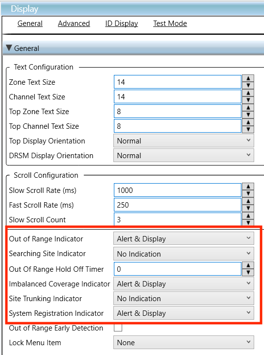

## Emergency Configuration

### Emergency Wide

On this page, configure whether **emergency signalling** may be received. Emergency signalling is [allowed on **HT-Test**](../README.md#ht-test).

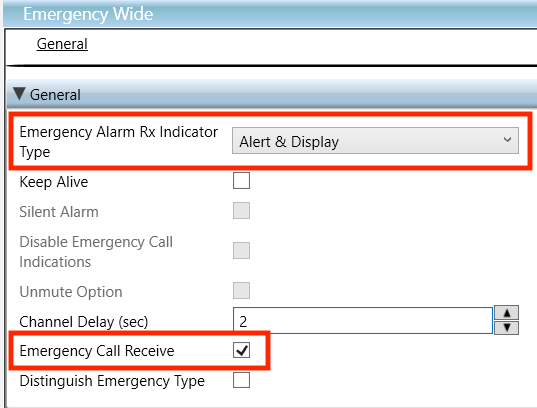

### Emergency Profile

On this page, configure an **emergency signalling profile**. Emergency signalling is [allowed on **HT-Test**](../README.md#ht-test).

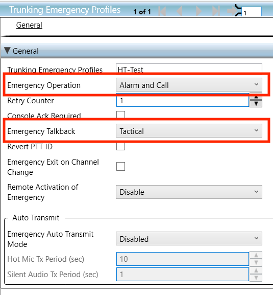

## Trunking System

### General

In this section, configure [basic system parameters](../README.md#general-system-info) like the **system ID**, **connect tone**, and [**radio/subscriber ID**](../README.md#unit--radio--subscriber-id).

Although the HamTrunk™ is a standalone single-site system, Motorola subscribers only show RSSI (signal strength) when they are set to SmartZone **coverage**.

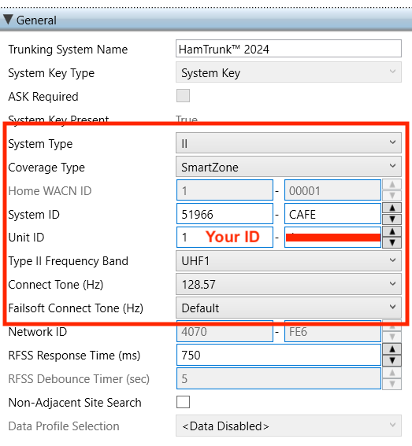

### OBT Channel Assignment

In this section, configure the [**OBT bandplan**](../README.md#obt-bandplan) for the system.

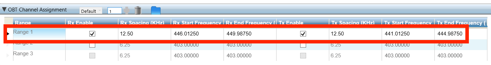

### Control Channels

In this section, configure the [**control channels**](../README.md#control-channels) for the system.

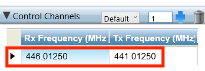

### Type II Channel Setup

In this section, configure the [**channel bandwidth**](../README.md#general-system-info) for the system.

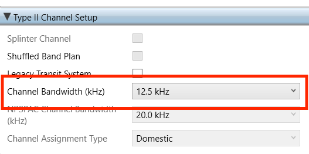

## Trunking Personality

Two Trunking Personalities are created, the first one for [**HT-Primary**](../README.md#ht-primary), and the second for [**HT-Test**](../README.md#ht-test).

This allows experimental features like emergency signalling, messages, and statuses to be enabled only on **HT-Test**.

### General

In this section, configure the **emergency profile** for the personality.

#### Personality 1

Emergency signalling is [NOT allowed on **HT-Primary**](../README.md#ht-primary).

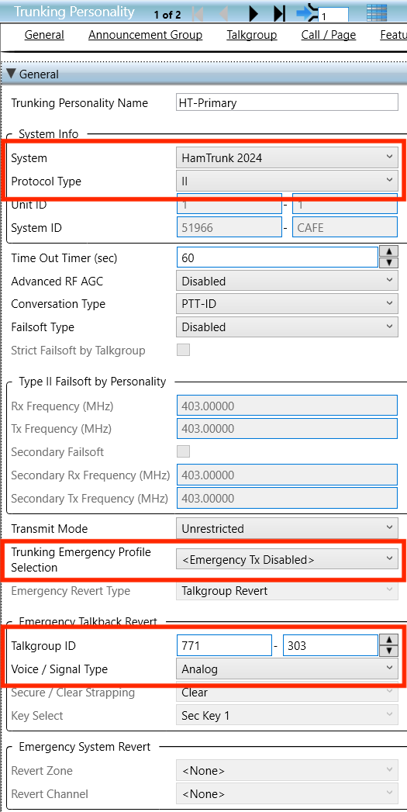

#### Personality 2

Emergency signalling is [allowed on **HT-Test**](../README.md#ht-test).

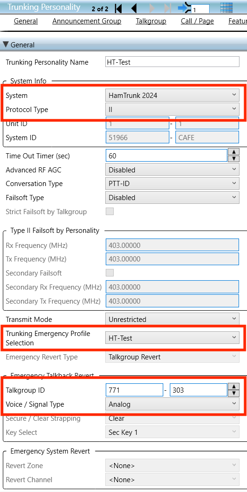

### Announcement Group

In this section, configure the [**HT-ATG** announcement group](../README.md#ht-atg).

#### Both personalities

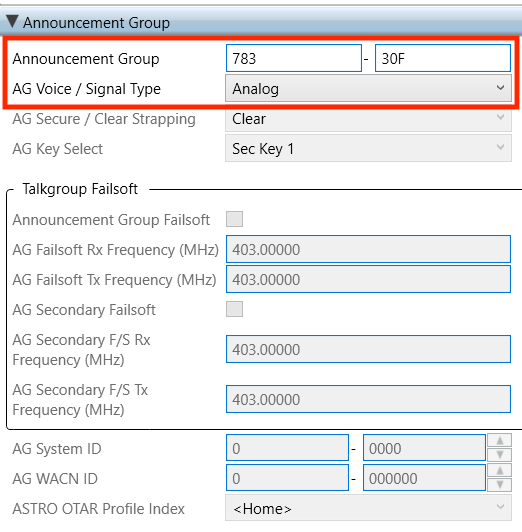

### Talkgroup

In this section, configure the [**talkgroup ID**](../README.md#talkgroups).

#### Personality 1

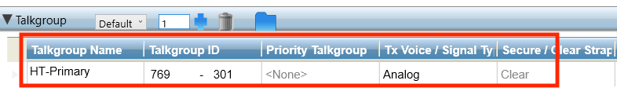

#### Personality 2

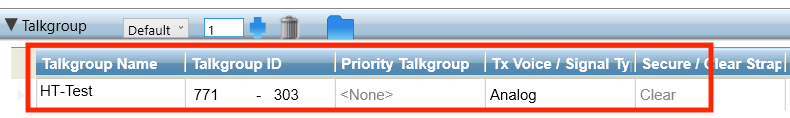

### Call/Page

In this section, configure the [**private call**](../README.md#private-calls) and [**call alert**](../README.md#call-alerts) settings for the personality.

#### Both personalities

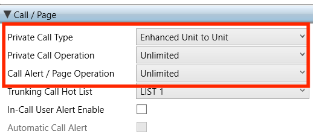

### Features

In this section, configure support for **messages** and **statuses** for the personality.

#### Personality 1

Messages and statuses are [NOT allowed on **HT-Primary**](../README.md#ht-primary).

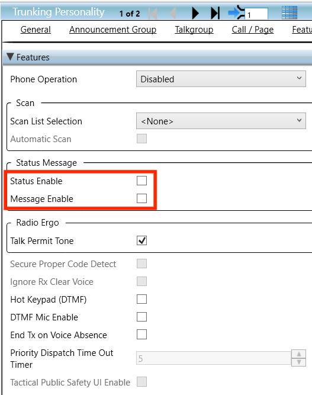

#### Personality 2

Messages and statuses are [allowed on **HT-Test**](../README.md#ht-test).

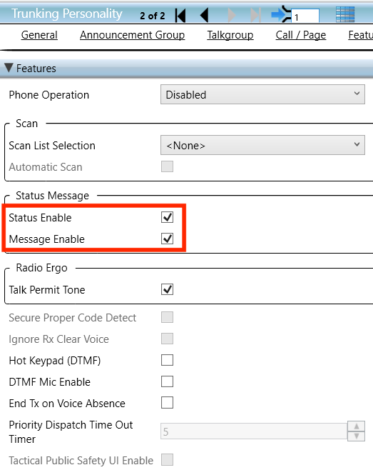

## Zone Channel Assignment

On this page, configure the **channel assignments** for the radio.

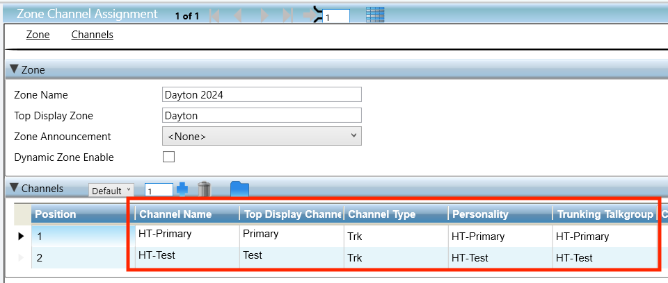
