# EF Johnson Armada

If a feature is not marked, leave it as the default.

## Systems

### General Options

On this tab, configure [basic system parameters](../README.md#general-system-info) like the **system ID**, **connect tone**, **channel bandwidth**, **conversation type**, and [**radio/subscriber ID**](../README.md#unit--radio--subscriber-id).

The HamTrunk™ is a standalone single-site system, so it operates in site trunking. Turn off this indicator so the radio does not constantly remind you of this fact.

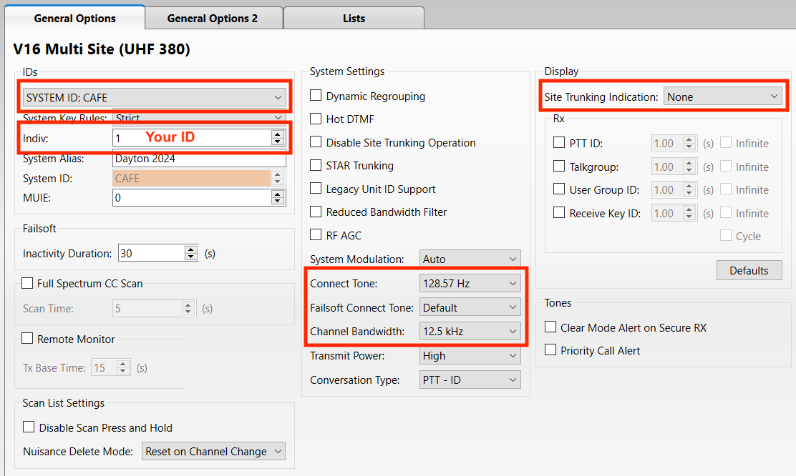

### General Options 2

Although the HamTrunk™ hopes to provide excellent coverage, it is useful to know when a radio is going **out of range** of the system.

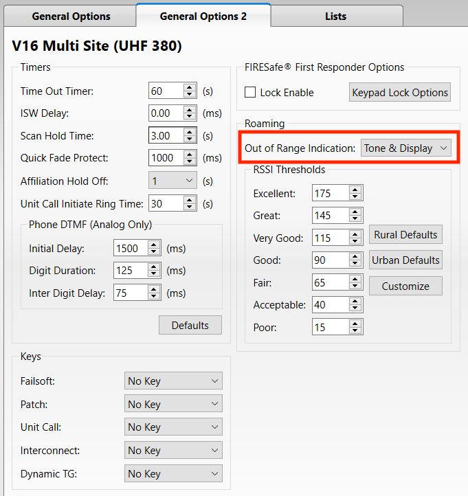

### Lists

#### Announcement Groups

On this page, configure the [**HT-ATG** announcement group](../README.md#ht-atg) and assign it to the two talkgroups.

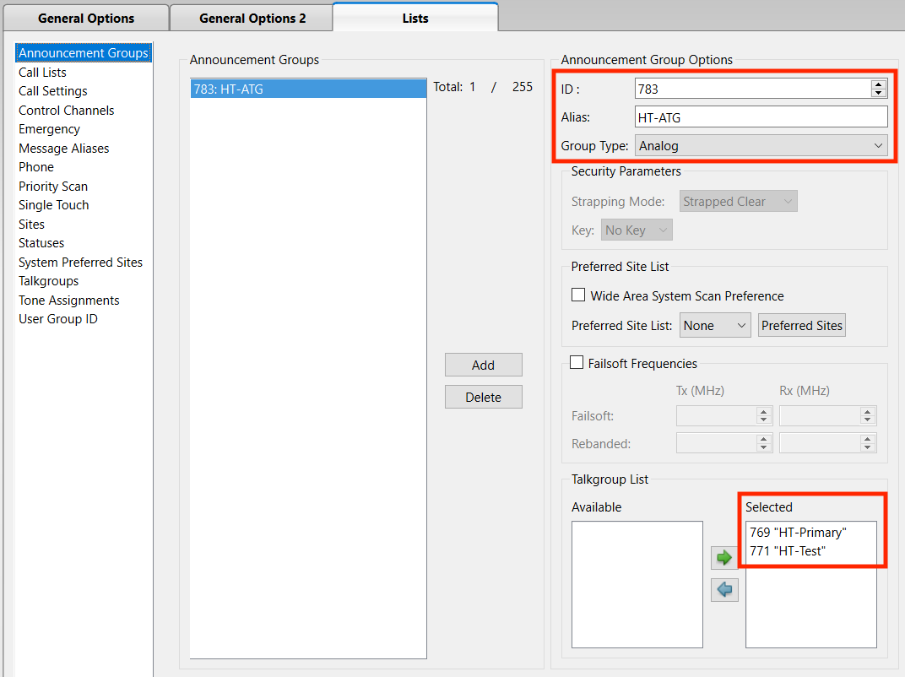

#### Call Settings

On this page, configure the [**private call**](../README.md#private-calls) and [**call alert**](../README.md#call-alerts) settings for the personality.

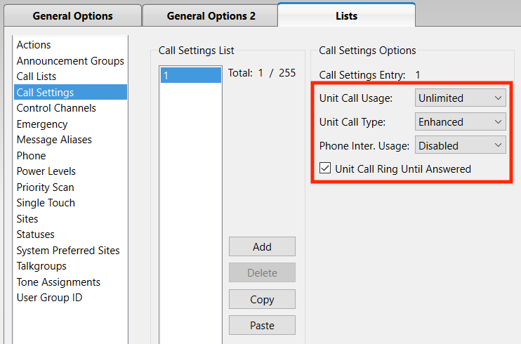

#### Control Channels

On this page, configure the [**control channels**](../README.md#control-channels) for the system.

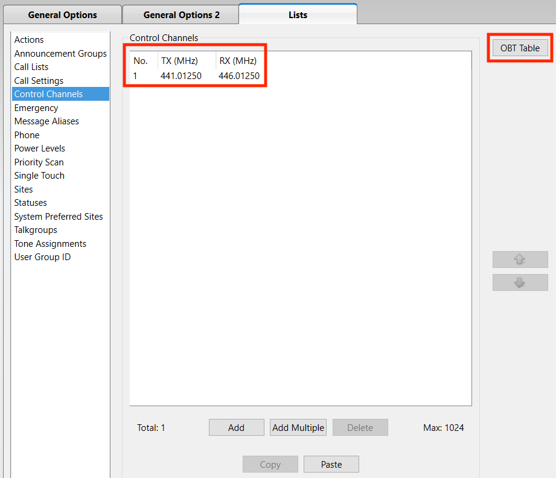

#### Control Channels > OBT Table

In this window, configure the [**OBT bandplan**](../README.md#obt-bandplan) for the system.

#### Emergency

On this page, configure the **emergency signalling** options.

Emergency signalling is [NOT allowed on **HT-Primary**](../README.md#ht-primary).

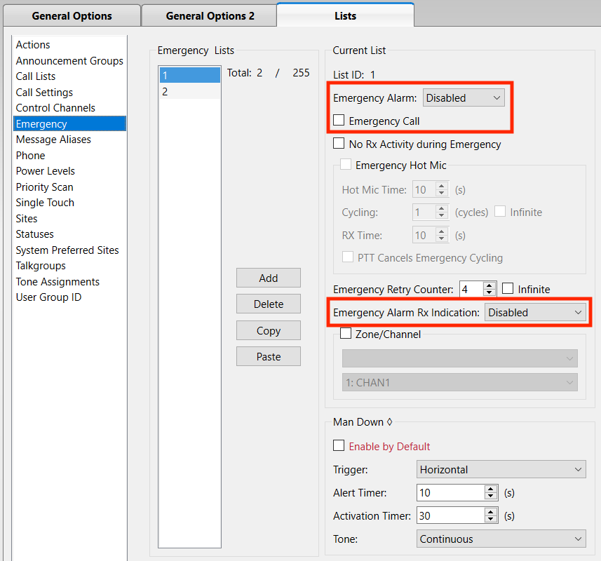

Emergency signalling is [allowed on **HT-Test**](../README.md#ht-test).

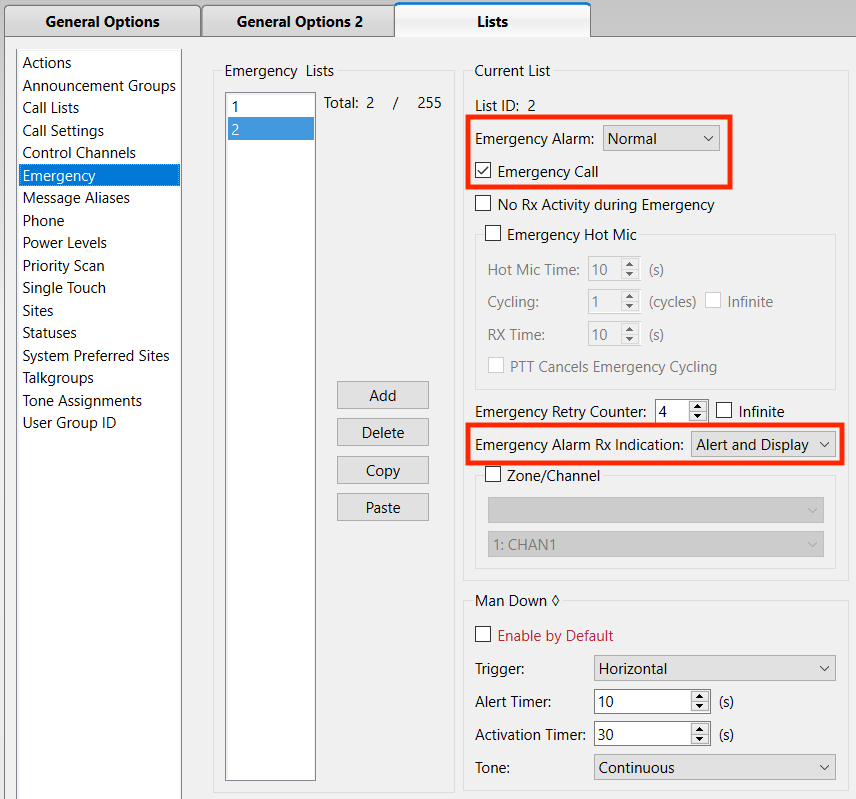

#### Talkgroups

On this page, configure the [**talkgroup IDs**](../README.md#talkgroups).

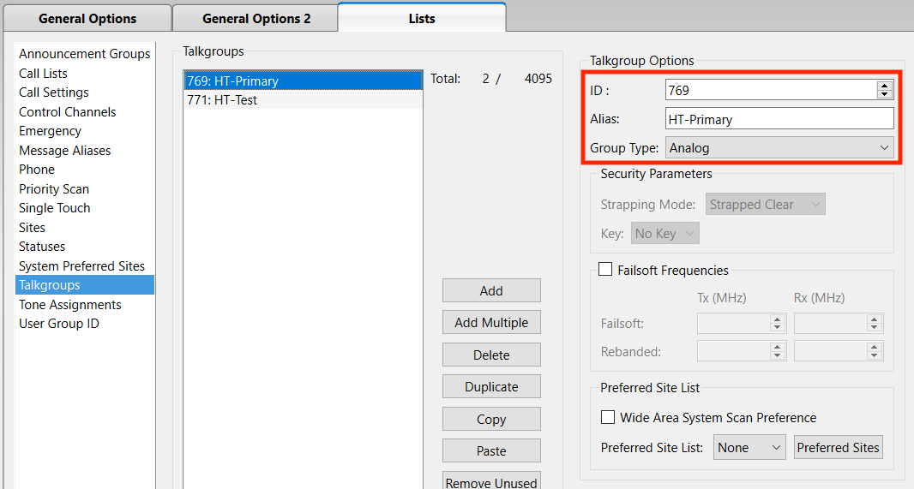
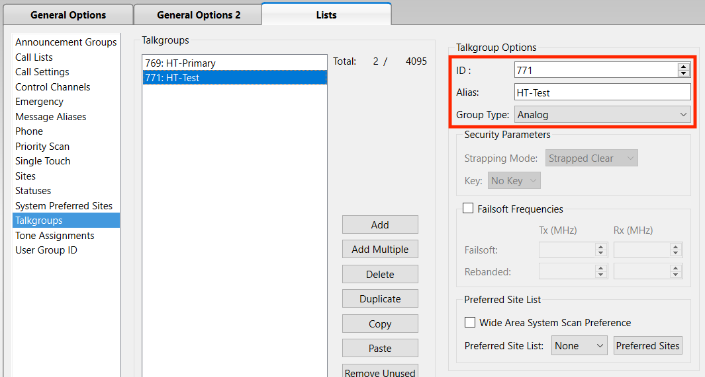

## Zones

On this page, configure the **zone/channel assignments** for the radio.

## Channels

On this page, configure the **channel settings** for the radio.

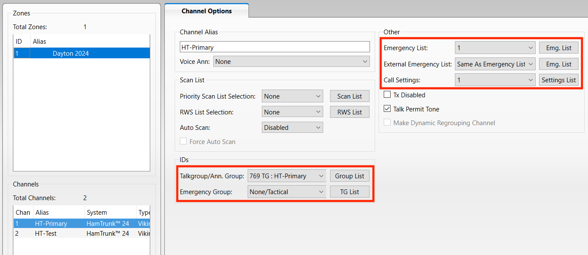
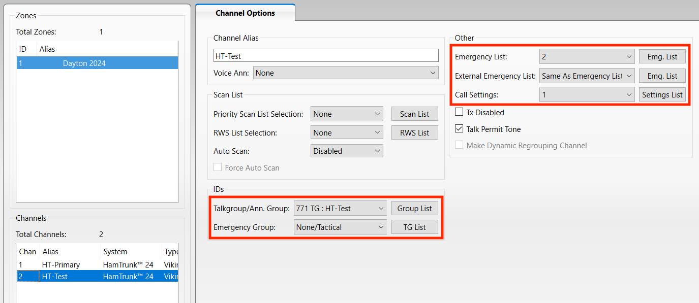
