# Motorola ASTRO CPS

If a feature is not marked, leave it as the default.

## Radio Configuration

### Display > Advanced

On this tab, enable **emergency call receive**. Emergency signalling is [allowed on **HT-Test**](../README.md#ht-test).

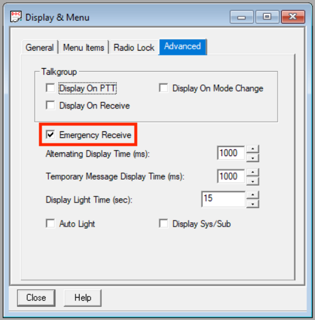

## Trunking Configuration

### SMARTZone

The HamTrunk™ is a standalone single-site system, so it operates in site trunking. Uncheck this so the radio does not constantly remind you of this fact.

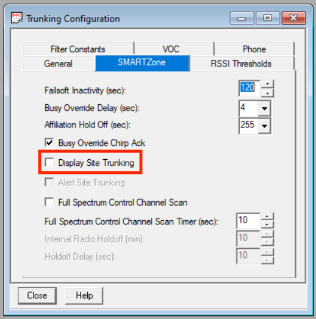

## Trunking System

### General

On this tab, configure [basic system parameters](../README.md#general-system-info) like the **system ID** and **connect tone**.

Although the HamTrunk™ is a standalone single-site system, Motorola subscribers only show RSSI (signal strength) when they are set to SmartZone **coverage**.

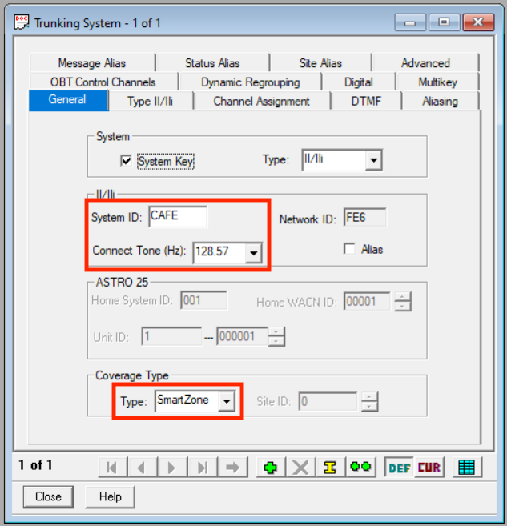

### Type II

On this tab, configure your [**radio/subscriber ID**](../README.md#unit--radio--subscriber-id).

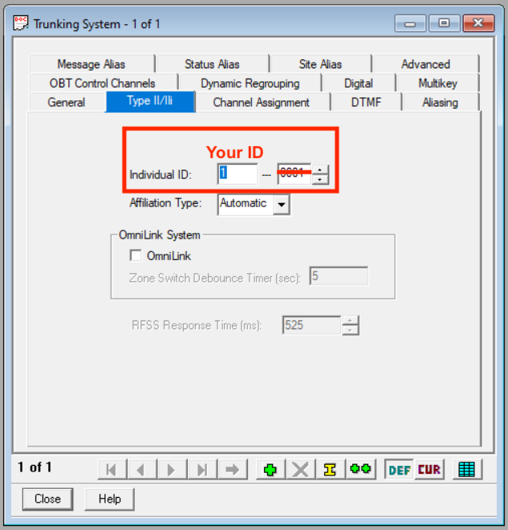

### Channel Assignment

On this tab, configure the [**OBT bandplan**](../README.md#obt-bandplan) for the system.

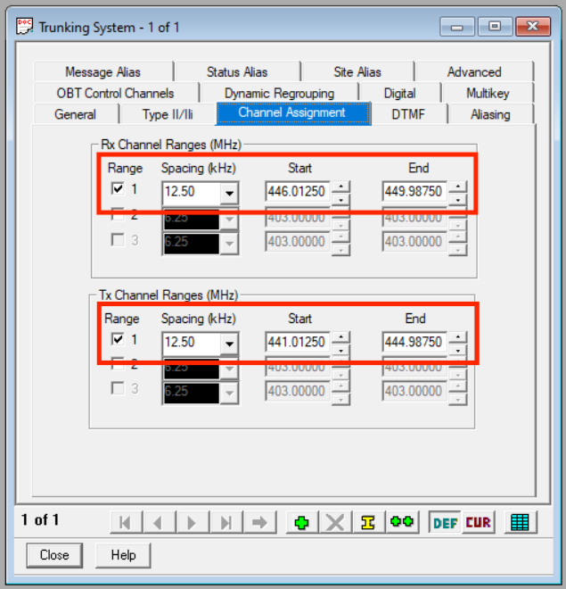

### Advanced

On this tab, configure the [**channel bandwidth**](../README.md#general-system-info) for the system.

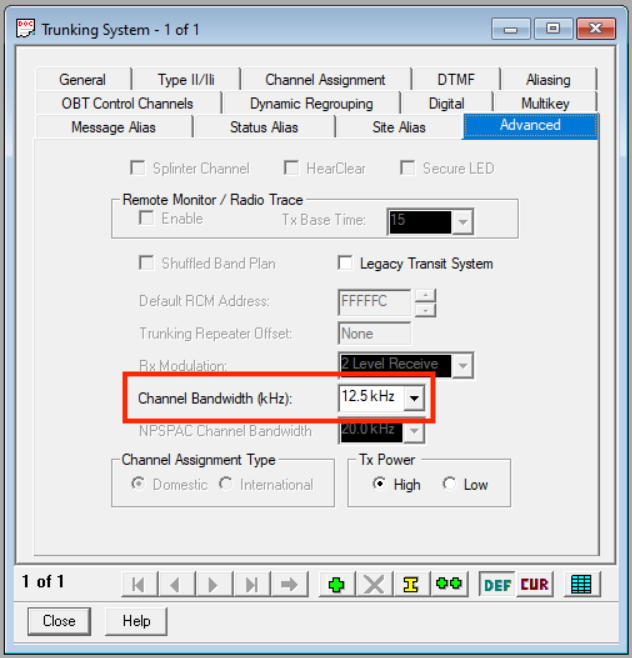

### OBT Control Channels

On this tab, configure the [**control channels**](../README.md#control-channels) for the system.

## Trunking Personality

Two Trunking Personalities are created, the first one for [**HT-Primary**](../README.md#ht-primary), and the second for [**HT-Test**](../README.md#ht-test).

This allows experimental features like emergency signalling, messages, and statuses to be enabled only on **HT-Test**, per the [talkgroup rules](../README.md#talkgroups).

### General

#### Both personalities

On this tab, configure the [**HT-ATG** announcement group](../README.md#ht-atg).

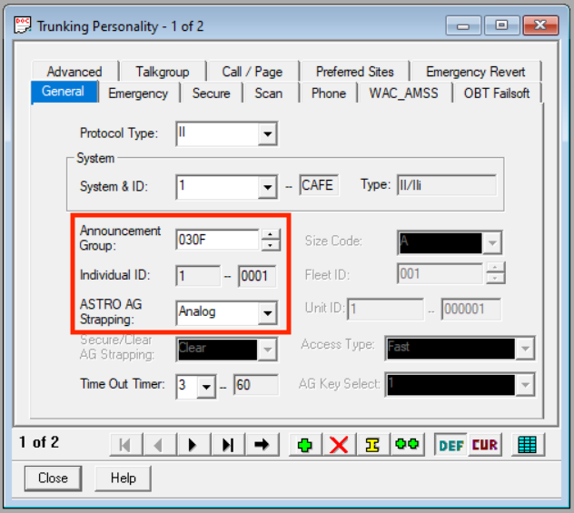

### Emergency

On this tab, configure the **emergency signalling** options.

#### Personality 1

Emergency signalling is [NOT allowed on **HT-Primary**](../README.md#ht-primary).

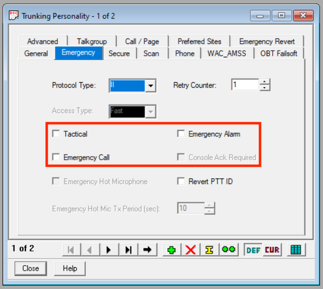

#### Personality 2

Emergency signalling is [allowed on **HT-Test**](../README.md#ht-test).

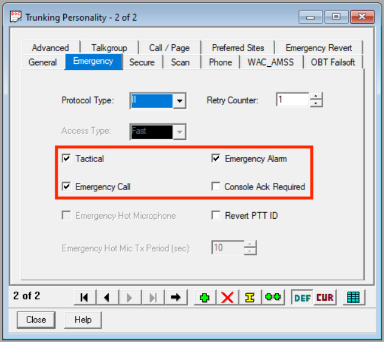

### Advanced

On this tab, configure the **conversation type** and support for **messages** and **statuses** for the personality.

#### Personality 1

Messages and statuses are [NOT allowed on **HT-Primary**](../README.md#ht-primary).

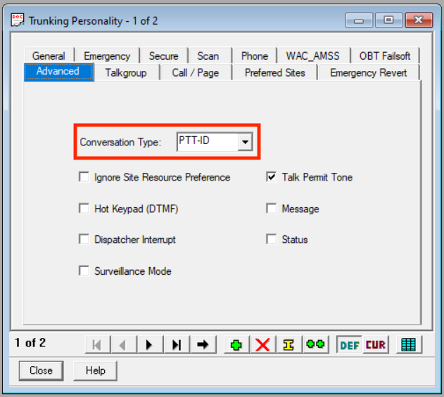

#### Personality 2

Messages and statuses are [allowed on **HT-Test**](../README.md#ht-test).

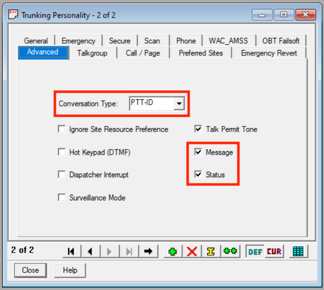

### Talkgroup

On this tab, configure the [**talkgroup ID**](../README.md#talkgroups).

#### Personality 1

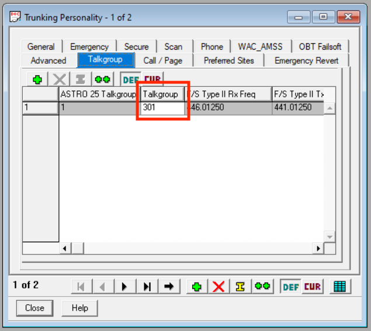

#### Personality 2

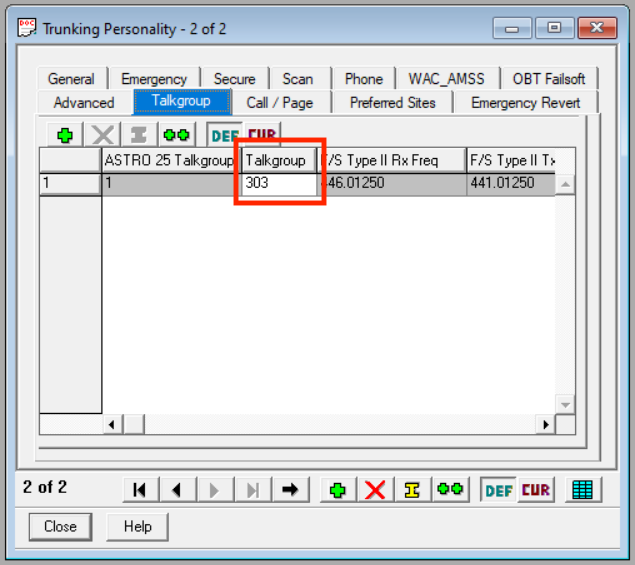

### Call/Page

#### Both personalties

On this tab, configure the [**private call**](../README.md#private-calls) and [**call alert**](../README.md#call-alerts) settings for the personality.

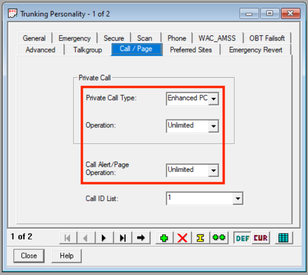

### Emergency Revert

#### Both personalties

On this tab, configure the **emergency revert** settings for the personality. This ensures that emergencies are [only transmitted on **HT-Test**](../README.md#ht-test).

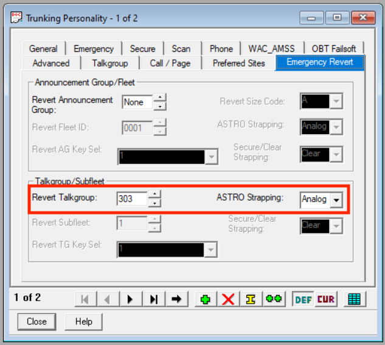

## Zone Channel Assignment

On this page, configure the **channel assignments** for the radio.

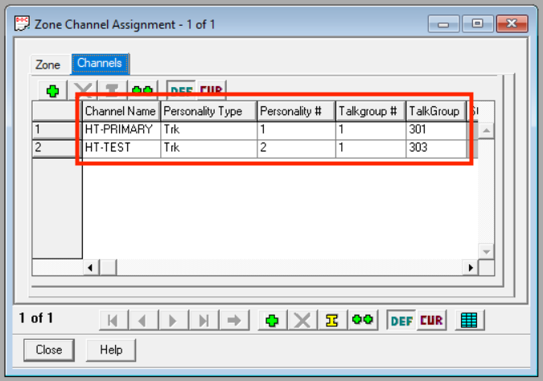