# EF Johnson PCConfigure

If a feature is not marked, leave it as the default.

## Systems

Two Trunking Personalities are created, the first one for [**HT-Primary**](../README.md#ht-primary), and the second for [**HT-Test**](../README.md#ht-test).

This allows experimental features like emergency signalling, messages, and statuses to be enabled only on **HT-Test**.

### General Options

On this tab, configure [basic system parameters](../README.md#general-system-info) like the **system ID**, **connect tone**, **channel bandwidth**, **conversation type**, and [**radio/subscriber ID**](../README.md#unit--radio--subscriber-id).

On this tab also configure **emergency signalling** options.

Emergency signalling is [NOT allowed on **HT-Primary**](../README.md#ht-primary).

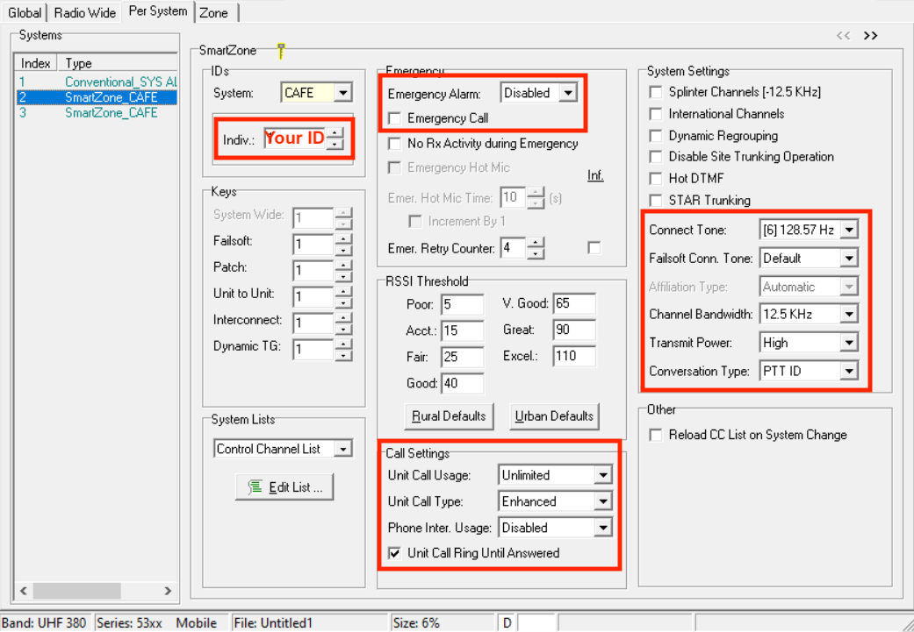

Emergency signalling is [allowed on **HT-Test**](../README.md#ht-test).

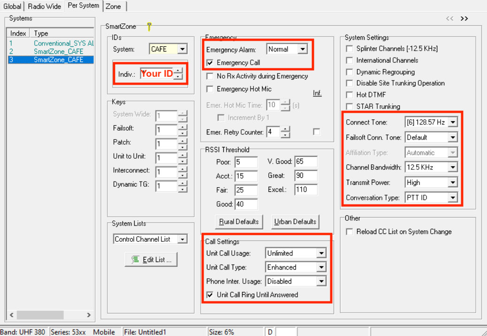

### Lists

#### Control Channels

In this window, configure the [**control channels**](../README.md#control-channels) for the system.

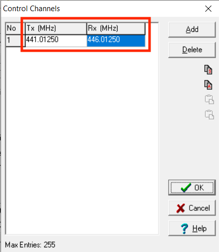

#### Talk Groups

In this window, configure the [**talkgroup IDs**](../README.md#talkgroups).

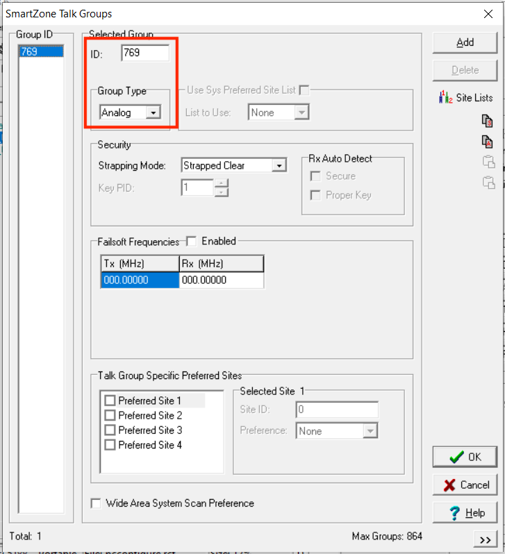
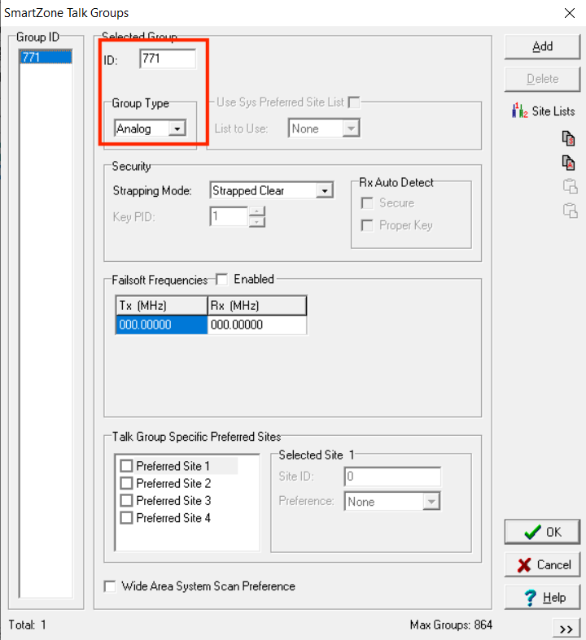

#### Announcement Groups

In this window, configure the [**HT-ATG** announcement group](../README.md#ht-atg) and assign it to the talkgroups.

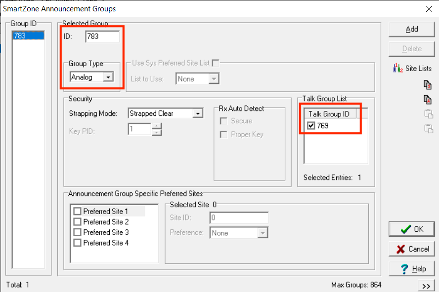
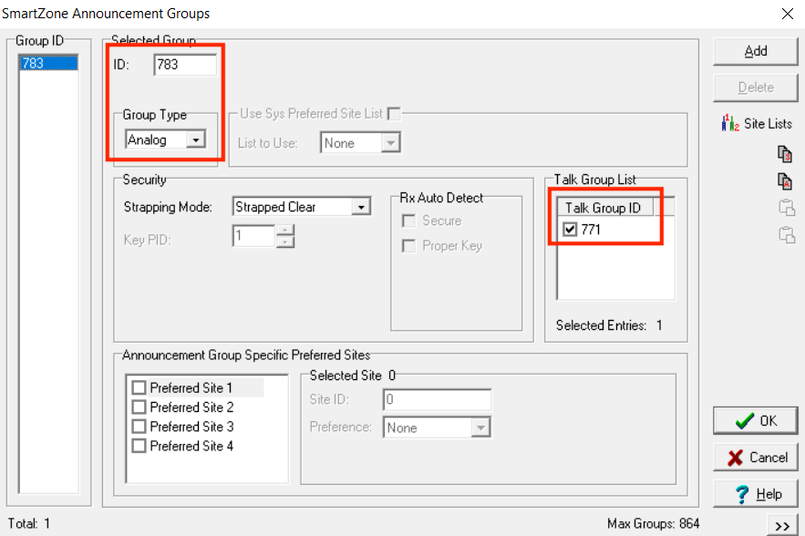

#### Other Band Trunking

In this window, configure the [**OBT bandplan**](../README.md#obt-bandplan) for the system.

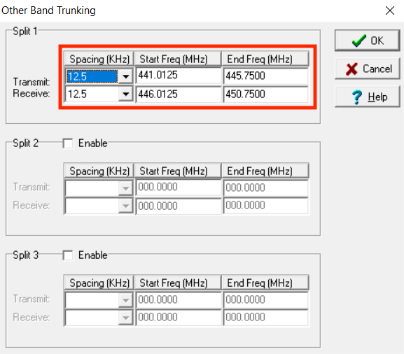

## Zones

### Zones and Channels

On this tab, first configure the **zone/channel assignments** for the radio.

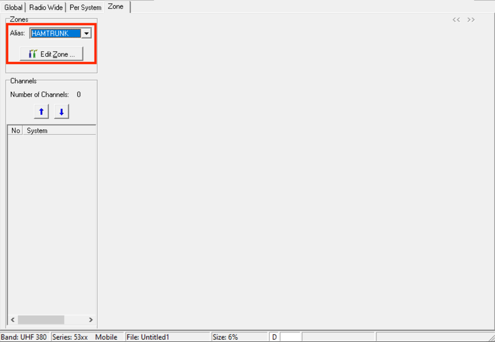
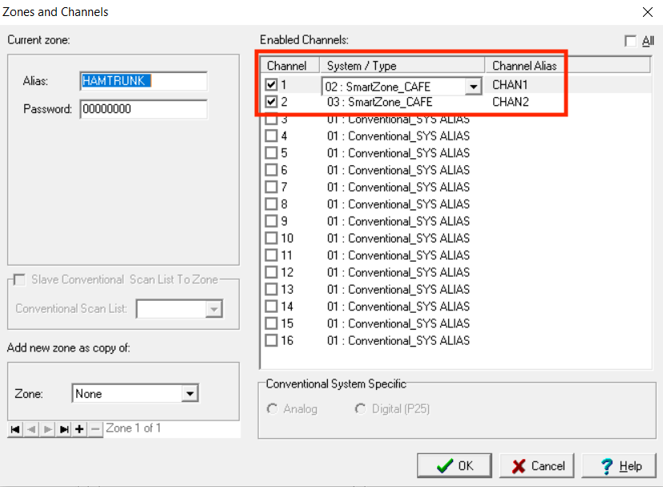

## Channels

Next, configure the **channel settings** for the radio.

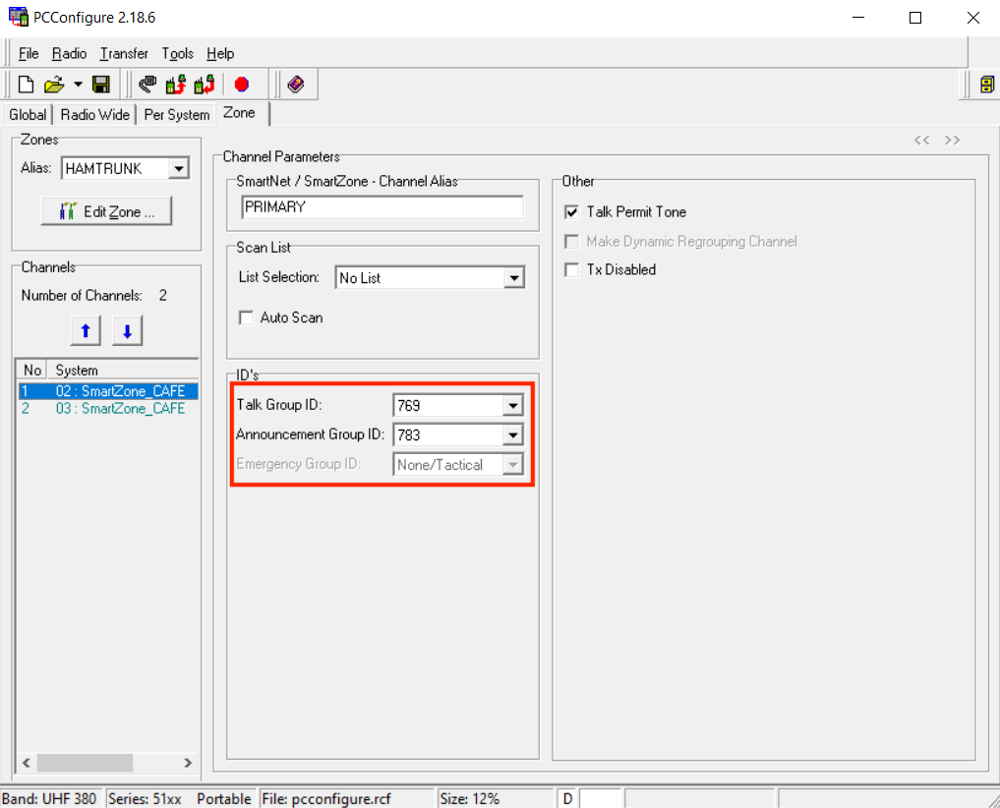
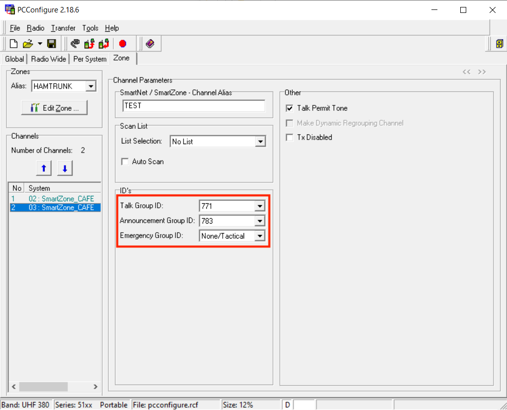
